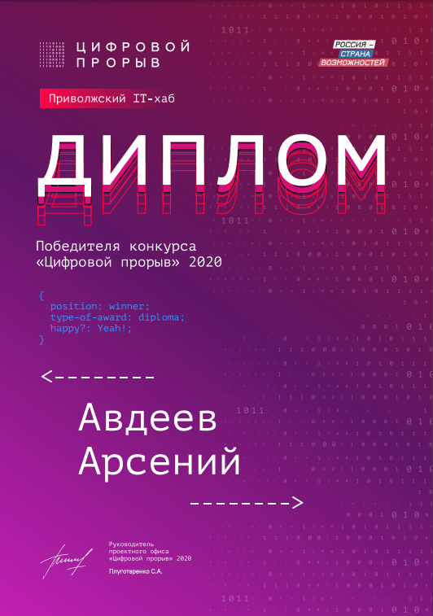
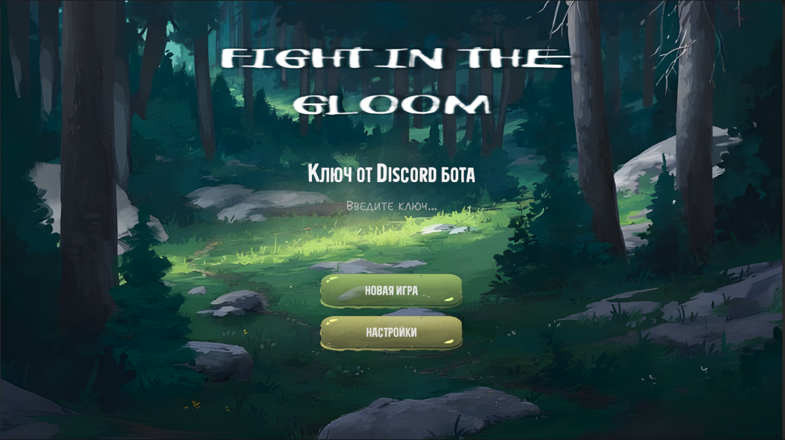
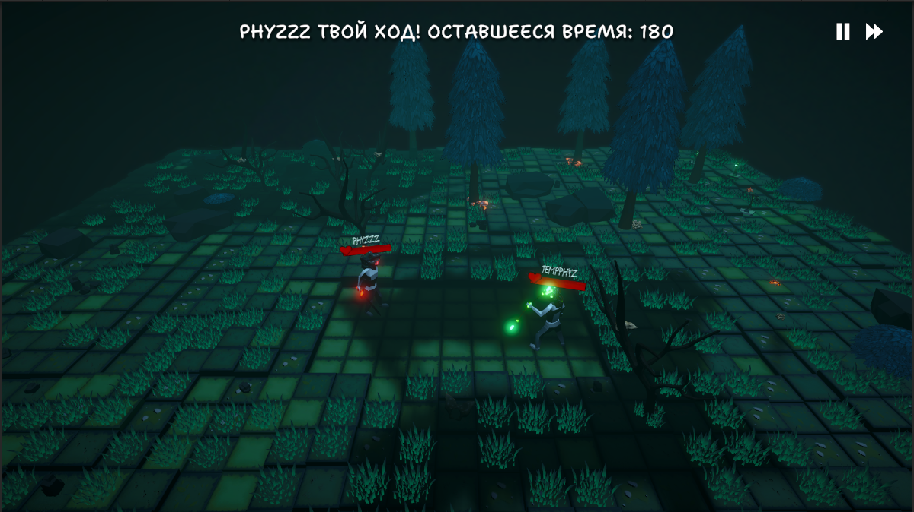
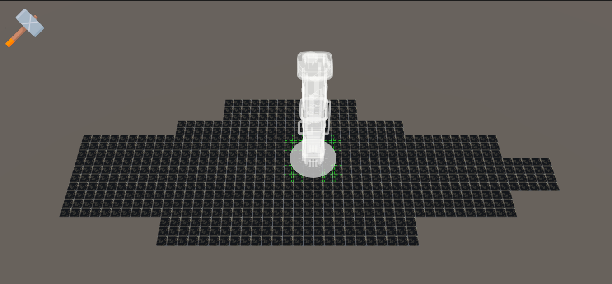

### Hi there / Приветствую! 👋😀 [ENG/RU]

---

## Portfolio structure / Структура портфолио 

#### 1) About me / Обо мне 
#### 2) Achievements / Достижения
#### 3) Projects / Проекты
#### 4) Statistics / Статистика

## About me / Обо мне 👦
_[RU]_

Меня зовут Арсений. Мне 21 год. Родом из города Волгоград, Россия. На данный момент являюсь студентом магистратуры ВолГУ.

Получил **высшее образование** (бакалавриат по направлению **Математика и компьютерные науки**) в Волгоградском Государственном Университете и продолжаю обучение в магистратуре.

Имею опыт участия в **региональных** хакатонах, а так же проходил во **всероссийский финал** по одному из них.

В текущее время занимаюсь дополнением своего портфолио различного рода маленькими играми и пэт-проектами. В них я пытаюсь применять и изучать различные **паттерны проектирования** и **SOLID**.

_[ENG]_

My name is Arseny. I am 21 years old. Originally from Volgograd, Russia. At the moment I am a master's student at VolSU.

I received **higher education** (bachelor's degree in **Mathematics and Computer Science**) at Volgograd State University and continue my studies in the master's program.

I have experience participating in **regional** hackathons, and also made it to the **All-Russian final** in one of them.

Currently, I am working on adding various small games and pet-projects to my portfolio. In them, I try to apply and learn different **design patterns** and **SOLID**.

## Achievements / Достижения 🏆

__[RU]__
- **Цифровой прорыв (Региональный хаб) - Приволжский IT-хаб** - _2 место_. Роль: _Front-end_.
- **Цифровой прорыв (Финальная стадия)** - _7 место_. Роль: _Back-end_.
- Церемония награждения участников хакатона Цифровой прорыв от администрации Волгоградской области.
- Еще несколько хакатонов.

_[ENG]_
- **Leaders of digital (Regional hub) - Privolzhsky IT hub** - _2nd place_. Role: _Front-end_.
- **Leaders of digital (Final Stage)** - _7th place_. Role: _Back-end_.
- Letter of gratitude from the administration of the Volgograd region.
- A few more hackathons.

## Projects / Проекты 👨‍💻
### Asteroids

### educational-project-3

_[RU]_

Кооперативная игра для двоих человек через Discord-бота.

Реализованные механики:
- Связь с Discord API.
- Выбор персонажа, его класса и действий через реакции на сообщения бота.
- Процедурная генерация левела.
- Боевка и передвижение персонажей.
- Синематик пролетки камеры.
- Прогресс бар загрузки сцены.

_[ENG]_

Co-op game for two people via Discord bot.

Implemented mechanics:
- Connection with Discord API.
- Selecting a character, his class and actions through reactions to bot messages.
- Procedural level generation.
- Combat and character movement.
- Cinematic camera flyover.
- Progress bar for loading the scene.

### educational-project-4

_[RU]_

Реализованные механики: 
- Автоматическое заполнение пола ячейками по заданным в эдиторе координатам.
- Выбор и размещение зданий по гриду.
- Диалоговая система при нажатии на любое здание.
- Переключение этажей.

_[ENG]_

Implemented mechanics:
- Automatic filling of the floor with cells according to the coordinates specified in the editor.
- Selection and placement of buildings on the grid.
- Dialogue system with voice to any building.
- Switching floors.

### educational-project-2

_[RU]_

Реализованные механики:
- Стейт-машина для управления персонажем.
- Аниматор.

_[ENG]_

Implemented mechanics:
- State machine for character control.
- Animator.

## Statistics / Статистика 📈

